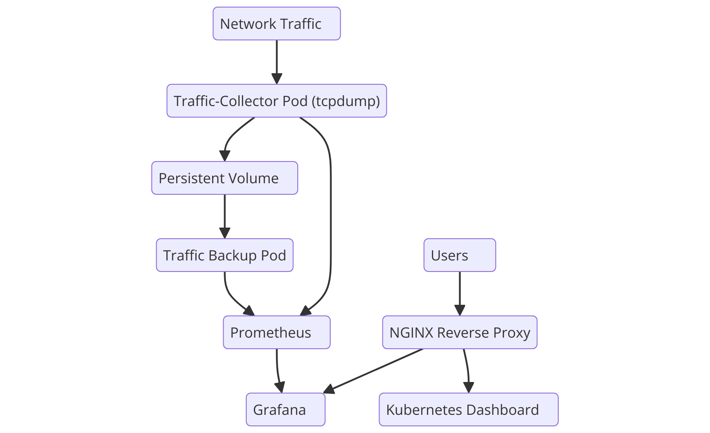

# Home Kubernetes Cluster for Network Monitoring and Automation

Welcome to the documentation for my home Kubernetes cluster project, where I’ve built a system for monitoring network traffic, storing data, and visualizing network metrics.

## Project Overview
This project involves deploying a Kubernetes cluster to capture network traffic using `tcpdump`, securely accessing it through an NGINX reverse proxy, and visualizing data using Prometheus and Grafana.

## Technologies Used
- **Kubernetes** for orchestration
- **Docker** for containerization
- **NGINX** for reverse proxying
- **Prometheus** & **Grafana** for monitoring
- **Ansible** for automation

## Key Components
- **Monitoring Pod**: [View Configuration](/yml-pages/monitoring-pod.html)
- **NGINX ConfigMap**: [View Configuration](/yml-pages/nginx-configmap.html)
- **NGINX Reverse Proxy**: [View Configuration](/yml-pages/nginx-reverse-proxy.html)
- **Persistent Volume**: [View Configuration](/yml-pages/persistent-volume.html)
- **Persistent Volume Claim**: [View Configuration](/yml-pages/persistent-volume-claim.html)
- **PrenticeOps Kubernetes Dashboard**: [View Configuration](/yml-pages/kubernetes-dash.html)
- **Prometheus Config**: [View Configuration](/yml-pages/prometheus-config.html)
- **Prometheus Service**: [View Configuration](/yml-pages/prometheus-service.html)
- **Grafana**: Installed via Helm for visualizing metrics collected by Prometheus.
- **Traffic Backup Pod**: [View Configuration](/yml-pages/traffic-backup.html)
- **Traffic Backup Service**: [View Configuration](/yml-pages/traffic-backup-service.html)
- **Traffic Collector Pod**: [View Configuration](/yml-pages/traffic-collector.html)
- **Traffic Collector Service**: [View Configuration](/yml-pages/traffic-collector-service.html)

## Project Architecture

[View Full Architecture Overview](architecture.html)

## Setup Guide
To set up the cluster, follow the [Setup Guide](./setup.html).

## Screenshots

## Future Enhancements
- Jenkins CI/CD pipeline for automated configuration updates.
- Alertmanager for comprehensive alerting.
